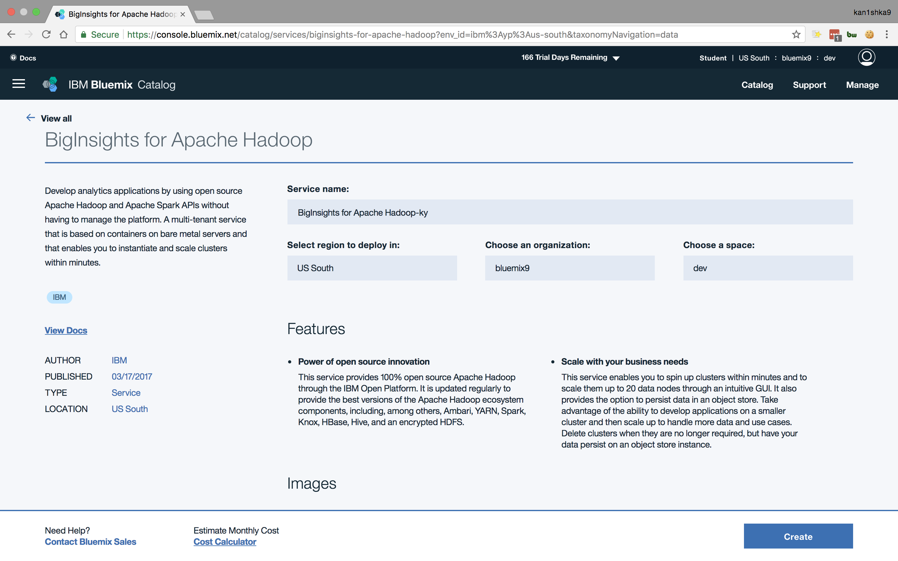
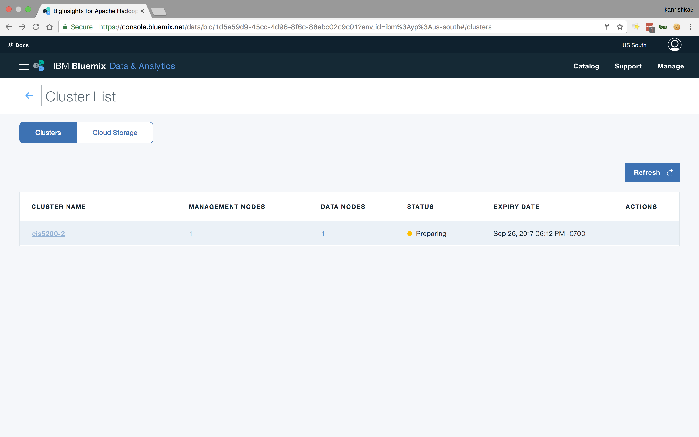

#### Hive Log File Analysis in IBM BigInsights

- Download website log files
- Create Hive tables to query those logs
- Create Hive queries to analyze the data
- Use Microsoft Excel to connect to BigInsight (using an ODBC connection) to retrieve the analyzed data








```hive
DROP TABLE IF EXISTS weblogs;

CREATE EXTERNAL TABLE IF NOT EXISTS weblogs(s_date date, s_time string, s_sitename string, cs_method string, cs_uristem string, cs_uriquery string, s_port int, cs_username string, c_ip string, cs_useragent string, cs_cookie string, cs_referer string, cs_host string, sc_status int, sc_substatus int, sc_win32status int, sc_bytes int, cs_bytes int, s_timetaken int ) ROW FORMAT DELIMITED FIELDS TERMINATED BY ' ' STORED AS TEXTFILE LOCATION '/user/kan1shka/SampleLog/' TBLPROPERTIES ('skip.header.line.count'='2');

show tables;
```


```hive
DROP TABLE IF EXISTS ClientErrors;

CREATE EXTERNAL TABLE ClientErrors(sc_status int, cs_referer string, cs_page string, cnt int) ROW FORMAT DELIMITED FIELDS TERMINATED BY ',';

INSERT OVERWRITE TABLE ClientErrors
SELECT sc_status,
  cs_referer,
  concat(cs_uristem,'?', regexp_replace(cs_uriquery,
  'X-ARR-LOG-ID=[0-9a-f]{8}-[0-9a-f]{4}-[0-9a-f]{4}-[0-9a-f]{4}-[0-9a-f]{12}','')) cs_page,
  count(distinct c_ip) as cnt
FROM weblogs
WHERE sc_status >=400 and sc_status < 500
GROUP BY sc_status,
  cs_referer,
  concat(cs_uristem,'?', regexp_replace(cs_uriquery,
  'X-ARR-LOG-ID=[0-9a-f]{8}-[0-9a-f]{4}-[0-9a-f]{4}-[0-9a-f]{4}-[0-9a-f]{12}',''))
ORDER BY cnt;

show tables;
```


```hive
DROP TABLE IF EXISTS RefersPerDay;

CREATE EXTERNAL TABLE IF NOT EXISTS RefersPerDay(year int, month int, day int, cs_referer string, cnt int) ROW FORMAT DELIMITED FIELDS TERMINATED BY ',';

INSERT OVERWRITE TABLE RefersPerDay
SELECT year(s_date), month(s_date), day(s_date),
  cs_referer, count(distinct c_ip) as cnt
FROM weblogs
WHERE sc_status >=200 and sc_status <300
GROUP BY s_date, cs_referer
ORDER BY cnt desc;

show tables;
```


```hive
describe weblogs;

describe clienterrors;

describe refersperday;
```


```hive
select * from weblogs LIMIT 10;
```


```hive
select * from clienterrors  ORDER BY CNT DESC LIMIT 10;
```


```hive
select year, month, cs_referer from refersperday LIMIT 10;
```


```hive
DROP TABLE IF EXISTS ClientErrors;

CREATE EXTERNAL TABLE ClientErrors(sc_status int, cs_referer string, cs_page string, cnt int) ROW FORMAT DELIMITED FIELDS TERMINATED BY ',' STORED AS TEXTFILE LOCATION '/user/kan1shka/ClientErrors/';

INSERT OVERWRITE TABLE ClientErrors SELECT sc_status, cs_referer, concat(cs_uristem,'?', regexp_replace(cs_uriquery,'X-ARR-LOG-ID=[0-9a-f]{8}-[0-9a-f]{4}-[0-9a-f]{4}-[0-9a-f]{4}-[0-9a-f]{12}','')) cs_page,count(distinct c_ip) as cnt FROM weblogs WHERE sc_status >=400 and sc_status < 500 GROUP BY sc_status, cs_referer, concat(cs_uristem,'?', regexp_replace(cs_uriquery,'X-ARR-LOG-ID=[0-9a-f]{8}-[0-9a-f]{4}-[0-9a-f]{4}-[0-9a-f]{4}-[0-9a-f]{12}','')) ORDER BY cnt;
```


```hive
DROP TABLE IF EXISTS RefersPerDay;

CREATE EXTERNAL TABLE IF NOT EXISTS RefersPerDay(year int, month int, day int, cs_referer string, cnt int) ROW FORMAT DELIMITED FIELDS TERMINATED BY ',' STORED AS TEXTFILE LOCATION '/user/kan1shka/RefersPerDay/';

INSERT OVERWRITE TABLE RefersPerDay SELECT year(s_date), month(s_date), day(s_date), cs_referer, count(distinct c_ip) as cnt FROM weblogs WHERE sc_status >=200 and sc_status <300 GROUP BY s_date, cs_referer ORDER BY cnt desc;
```


