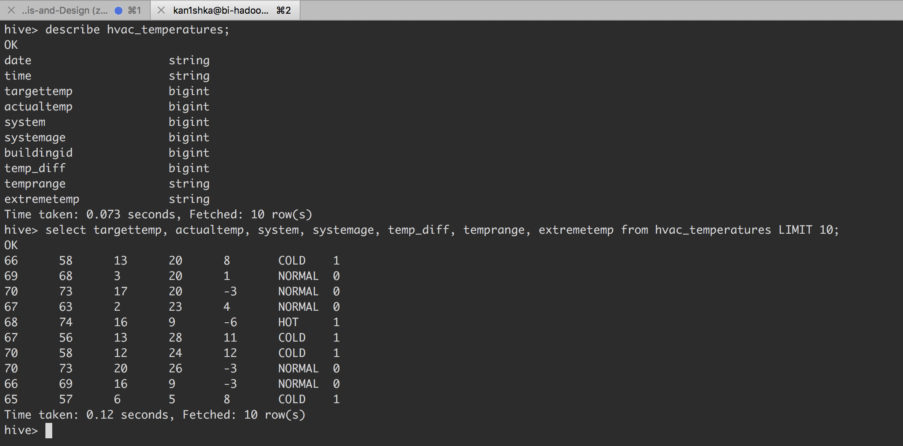
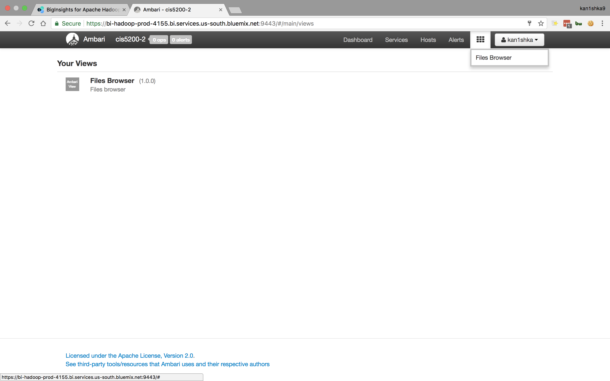
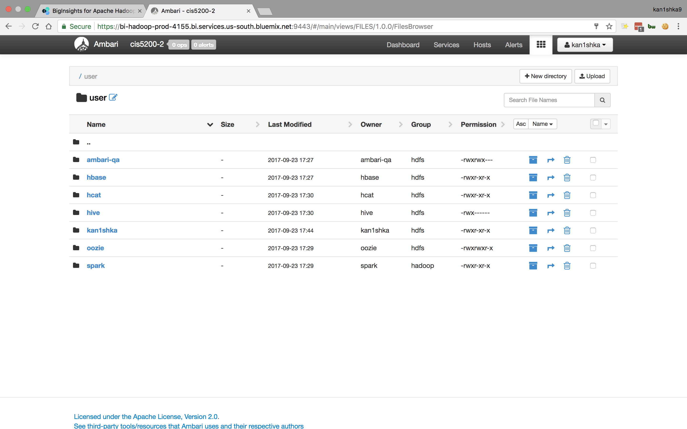
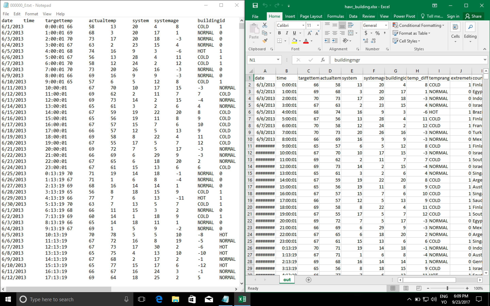
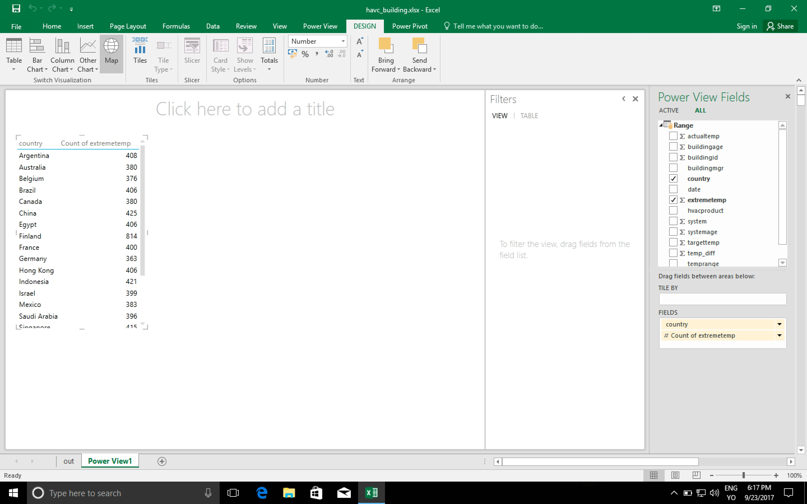

#### Hive Sensor Data Analysis Lab

- Download sensor data to the local systems in Bluemix BigInsights
- Upload it to HDFS
- Manipulate and analyze sensor data in HDFS using HiveQL
- Visualize the result in Excel


```sh
wget -O SensorFile.zip http://s3.amazonaws.com/hw-sandbox/tutorial14/SensorFiles.zip
unzip SensorFile.zip
hdfs dfs -mkdir SensorFiles
hdfs dfs -mkdir SensorFiles/hvac
hdfs dfs -mkdir SensorFiles/building
hdfs dfs -ls
```


```sh
cd SensorFiles
ls -l
hdfs dfs -put HVAC.csv SensorFiles/hvac
hdfs dfs -put building.csv SensorFiles/building
hdfs dfs -ls SensorFiles/building
hdfs dfs -ls SensorFiles/hvac
```


```
hive

DROP TABLE IF EXISTS hvac;

CREATE EXTERNAL TABLE IF NOT EXISTS hvac(`date` STRING, time STRING, targettemp BIGINT, actualtemp BIGINT, system BIGINT, systemage BIGINT, buildingid BIGINT) ROW FORMAT DELIMITED FIELDS TERMINATED BY ',' STORED AS TEXTFILE LOCATION '/user/kan1shka/SensorFiles/hvac' TBLPROPERTIES ('skip.header.line.count'='1');

show tables;

select * from hvac limit 10;
```


```
describe formatted hvac;
```


```
DROP TABLE IF EXISTS building;

CREATE EXTERNAL TABLE IF NOT EXISTS building(buildingid BIGINT, buildingmgr STRING, buildingage BIGINT, hvacproduct STRING, country STRING) ROW FORMAT DELIMITED FIELDS TERMINATED BY ',' STORED AS TEXTFILE LOCATION '/user/kan1shka/SensorFiles/building' TBLPROPERTIES ('skip.header.line.count'='1');

select * from building limit 10;
```


```
describe formatted building;
```


```
DROP TABLE IF EXISTS hvac_temperatures;

CREATE TABLE hvac_temperatures ROW FORMAT DELIMITED FIELDS TERMINATED BY ',' STORED AS TEXTFILE LOCATION '/user/kan1shka/SensorFiles/hvac_temperatures/' AS SELECT *, targettemp - actualtemp AS temp_diff, IF((targettemp - actualtemp) > 5, 'COLD', IF((targettemp - actualtemp) < -5, 'HOT', 'NORMAL')) AS temprange, IF((targettemp - actualtemp) > 5, '1', IF((targettemp - actualtemp) < -5, '1', 0)) AS extremetemp FROM hvac;

show tables;
```


```
describe hvac_temperatures;

select targettemp, actualtemp, system, systemage, temp_diff, temprange, extremetemp from hvac_temperatures LIMIT 10;
```



```
DROP TABLE IF EXISTS hvac_building;

CREATE TABLE hvac_building ROW FORMAT DELIMITED FIELDS TERMINATED BY ',' STORED AS TEXTFILE LOCATION '/user/kan1shka/SensorFiles/hvac_building/' AS SELECT h.*, b.country, b.hvacproduct, b.buildingage, b.buildingmgr FROM building b JOIN hvac_temperatures h ON b.buildingid = h.buildingid;

show tables hvac_building;
```


```
describe hvac_building;

select targettemp, actualtemp, system, systemage, temp_diff, temprange, extremetemp, country, hvacproduct, buildingmgr from hvac_building LIMIT 10;
```














