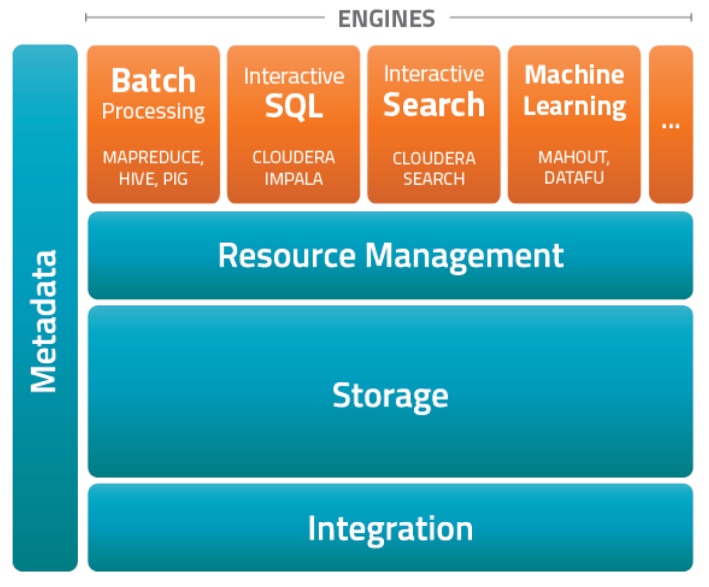
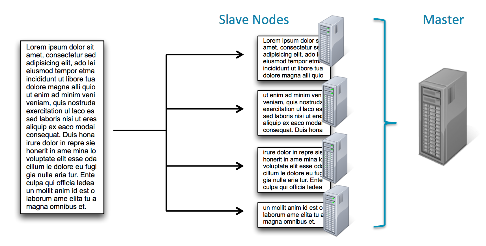
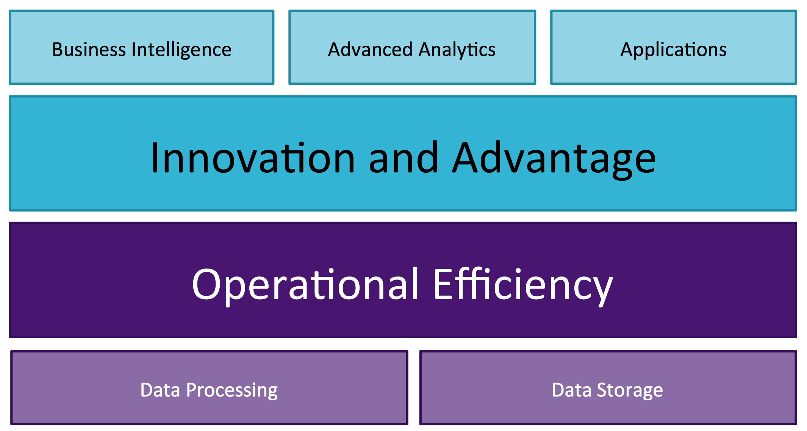
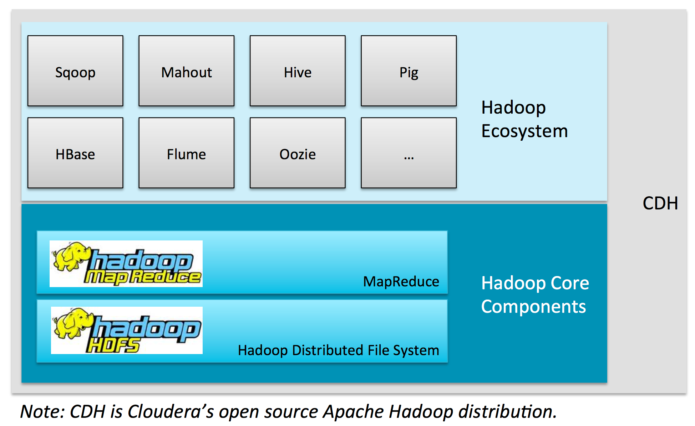
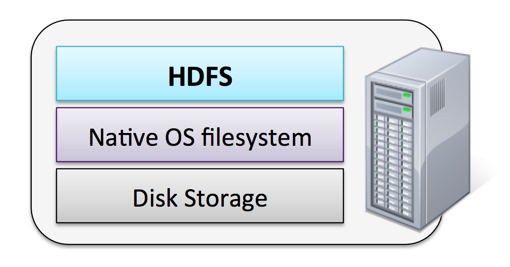
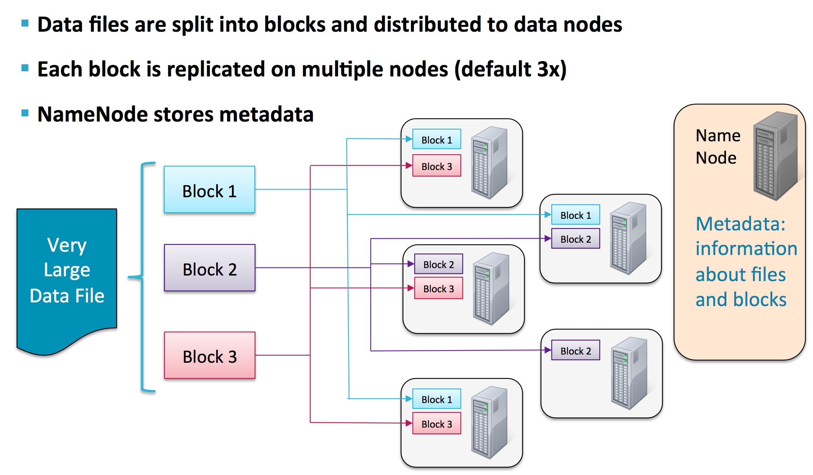
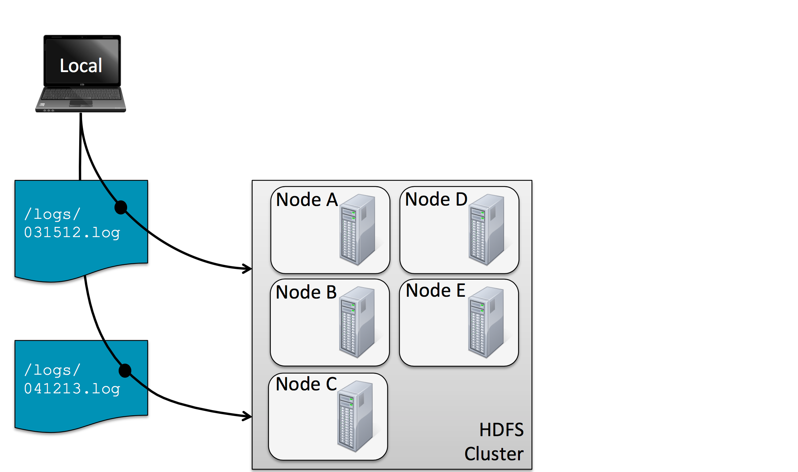
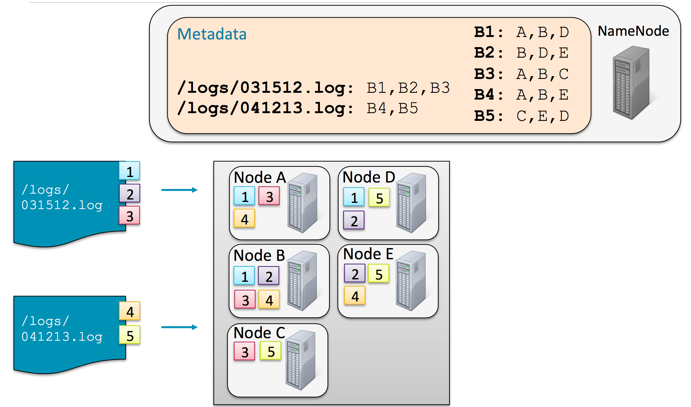
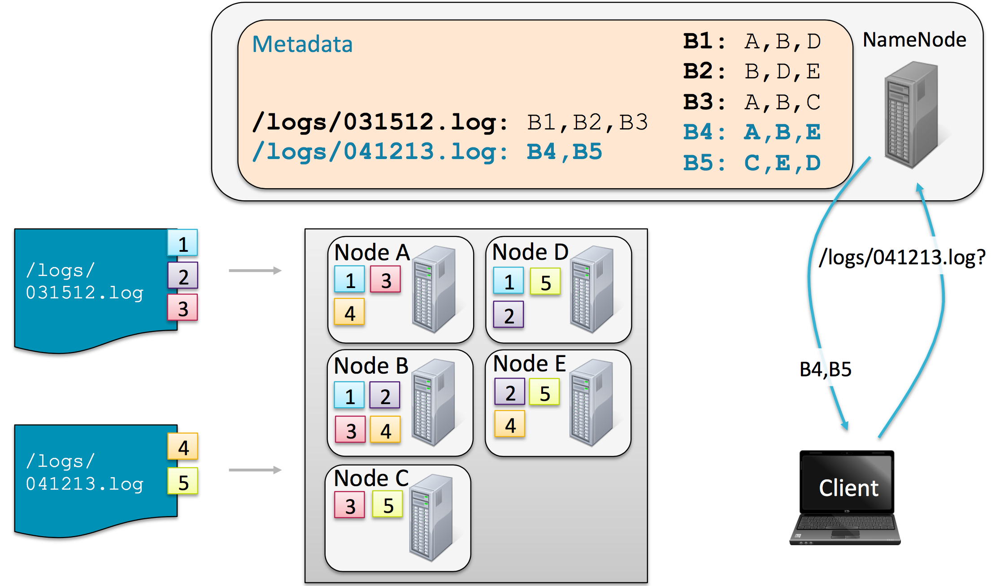
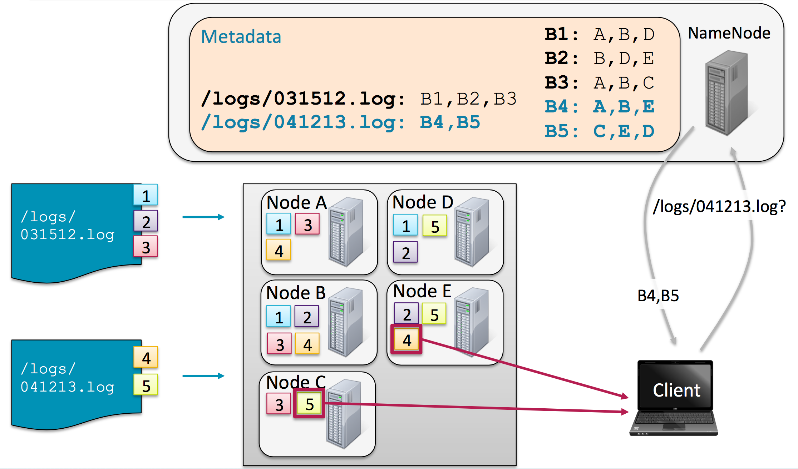

#### 1. Hadoop Core

###### Apache Hadoop

- Software Framework for storing, processing, analyzing big data
	- Distributed
	- Scalable
	- Fault-tolerant
	- Open source

- Hadoop is based on [Google File System](https://research.google.com/archive/gfs.html) and [MapReduce](https://research.google.com/archive/mapreduce.html)
	- Core concept
		- Distribute the data as it is initially stored in the system
		- Individual nodes can work on data local to those nodes
		- No data transfer over the network is required for initial processing

- [``What is Apache Hadoop?``](http://hadoop.apache.org/index.html)

**``Modules``**

1. ``Hadoop Common`` : The common utilities that support the other Hadoop modules.

2. ``Hadoop Distributed File System (HDFS)`` : A distributed file system that provides high-throughput access to application data.

3. ``Hadoop YARN`` : A framework for job scheduling and cluster resource management.

4. ``Hadoop MapReduce`` : A ``YARN``-based system for parallel processing of large data sets.

###### Open Source vs Commercial Hadoop Vendors

Vanilla       | Distribution, including Apache Hadoop
--------------|----------------------------------------
Apache Hadoop | Cloudera CDH Hadoop Distribution
 . | Hortonworks Data Platform (HDP)
 . | MapR Hadoop Distribution
 . | Amazon Elastic MapReduce
 . | IBM Open Platform
 . | Microsoft Azure's HDInsight -Cloud based Hadoop Distrbution
 . | Pivotal Big Data Suite
 . | Datameer Professional
 . | Datastax Enterprise Analytics
 . | Dell-Cloudera Apache Hadoop Solution

######  ``CDH`` - Cloudera Distribution of Hadoop



###### Advantages of Commercial Hadoop Vendors

- Support
- Reliability
- Completeness

###### Motivation for Hadoop

- Problem &rarr; Traditional Large-Scale Computation
	- processor-bound
	- bigger computers - Faster processor, more memory is not enough

- Solution &rarr; Distributed Systems
	- Use multiple machines for a single job
	- ``MPI`` ```Message Passing Interface``` 

###### Problem/Challenges with Distributed Systems

- Data exchange requires _**synchronization**_
- _**Finite bandwidth**_ is available
- Temporal _**dependencies**_ are complicated
- It is difficult to deal with _**partial failures**_ of the system
- Programming complexity
- _**Data Bottleneck**_
	- Getting the data to the processors becomes the bottleneck
		- terabytes+ per day
		- petabytes+ total

###### Requirements for a New Approach

- Partial Failure Support
	- Failure of a component should result in a graceful degradation of
application performance
	- Not complete failure of the entire system
- Data Recoverability
	-  If a component of the system fails, its workload should be assumed by still-functioning units in the system
	- Failure should not result in the loss of any data
- Component Recovery
	- If a component of the system fails and then recovers, it should be able to rejoin the system
	- Without requiring a full restart of the entire system
- Consistency
	- Component failures during execution of a job should not affect the outcome of the job
- Scalability
	- Increasing resources should support a proportional increase in load
capacity
	- Adding load to the system should result in a graceful decline in performance of individual jobs
	- Not failure of the system

- Solution to Distrubuted Systems
	- Individual nodes can work on data local to those nodes
	- No data transfer over the network is required for initial processing

- Core Hadoop Concepts
	- Applications are written in high-level code
	- Nodes talk to each other as little as possible
	- Data is spread among machines in advance

###### Core Hadoop Concepts

- Applications are written in high-level code
	- Developers need not worry about network programming, temporal
dependencies or low-level infrastructure
- Nodes talk to each other as little as possible
	- Developers should not write code which communicates between nodes
- Data is spread among machines in advance
	- Data is replicated multiple times on the system for increased availability and reliability
- Data is replicated for increased availability and reliability
- Hadoop is scalable and fault-tolerant

###### Hadoop: Very High-Level Overview

- Data is split into ``blocks`` when loaded
- Map tasks typically work on a single block
- A master program manages tasks



###### Hadoop-able Problems



###### Types of Analysis with Hadoop

- Text mining
- Index building
- Graph creation and analysis
- Oattern recognition
- Collaborative filtering
- Prediction models
- Sentiment analysis
- Risk assessment

###### Nature of the data

- Volume
- Velocity 
- Variety

###### Nature of the analysis

- Batch processing
- Parallel execution
- Distributed data

###### Hadoop consists of two core components

- The Hadoop Distributed File System (HDFS)
- MapReduce

###### Hadoop Cluster

- A set of machines running ``HDFS`` and ``MapReduce``
	- ``HDFS``
		- Stores data on the cluster
		- Data is split into blocks and distributed across multiple nodes in the cluster(64MB or 128MB in size)
		- Default is to replicate each block three times
		- Replicas are stored on different nodes
		- This ensures both reliability and availability
	- ``MapReduce``
		- System used to process data in the Hadoop cluster
		- Map &rarr; shuffle and sort &rarr; Reduce
		- After all Maps are complete, the MapReduce system distributes the
intermediate data to nodes which perform the Reduce phase
- Individual machines are known as ``nodes``



###### HDFS

- File system written in Java
- Sits on top of a native filesystem - ``ext3, ext4 or xfs``
- HDFS performs best with a modest number of large files
	- Millions, rather than billions, of files
	- Each file typically 100MB or more
- HDFS is optimized for large, streaming reads of files
	- Rather than random reads





###### Options for Accessing HDFS

- HDFS Commands Guide ``hdfs dfs``

```sh
hdfs dfs -put foo.txt foo.txt # Copy file foo.txt from local disk to the user’s directory in HDFS
hdfs dfs -ls # Get a directory listing of the user’s home directory in HDFS
hdfs dfs -ls / # Get a directory listing of the HDFS root director
hdfs dfs -cat /user/fred/bar.txt #  Display the contents of the HDFS file /user/fred/bar.txt
hdfs dfs -get /user/fred/bar.txt baz.txt # Copy that file to the local disk, named as baz.txt
hdfs dfs -mkdir input # Create a directory called input under the user’s home directory
hdfs dfs -rm -r input_old # Delete the directory input_old and all its contents
```

- Java API
- Ecosystem Projects
	- Flume
		- Collects data from network sources (e.g., system logs)
	- Sqoop
		- Transfers data between HDFS and RDBMS
	- Hue
		- Web-based interactive UI
		- Can browse, upload, download, and view files

###### Storing and Retrieving Files







