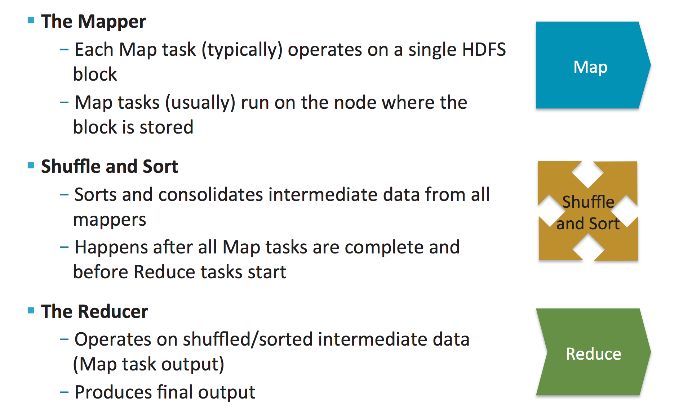
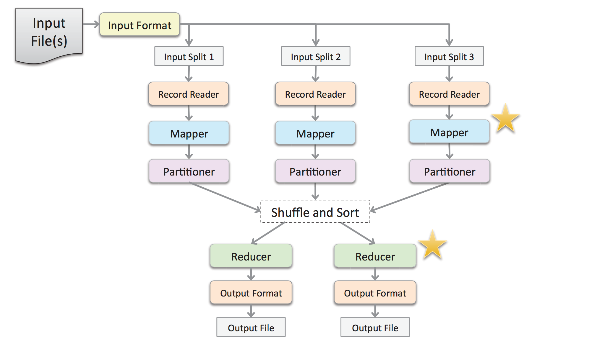
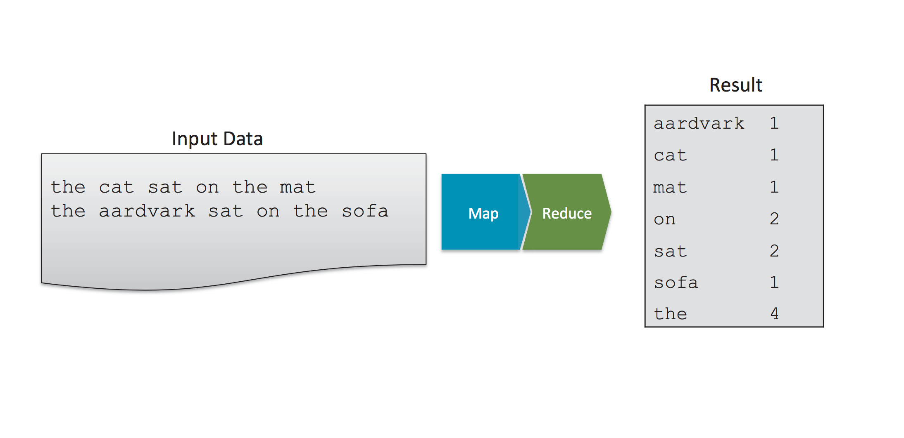
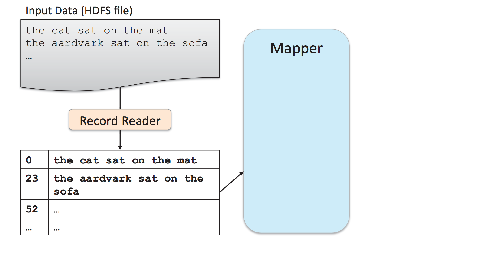
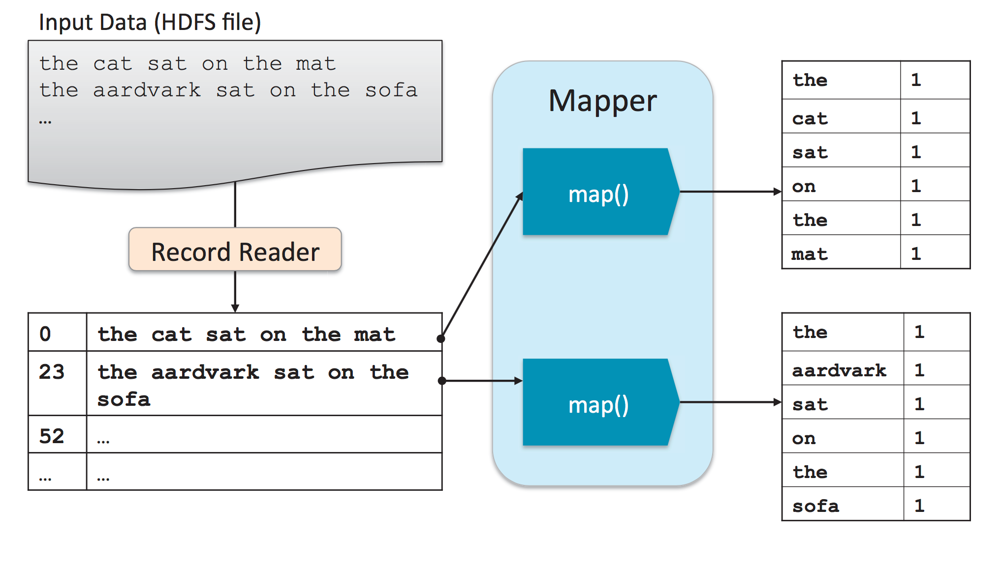
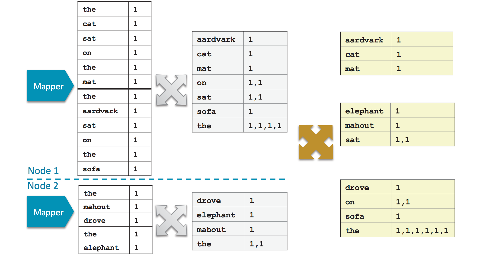
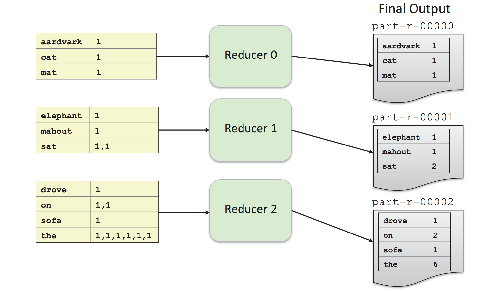
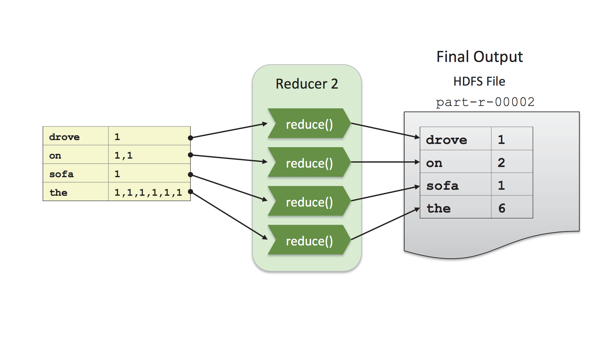

#### 2. Introduction to MapReduce

###### Features of MapReduce

- Automatic parallelization and distribution
- Fault-tolerant
- Clear abstraction for programmers
	- Written in JAVA
	- Can be written in other languages using ``Hadoop Streaming``
- MapReduce abstracts all the ``housekeeping`` away from developer
	- Developers can simply concentrate on writing ``Map`` and ``Reduce`` function

###### Mapreduces Flow

###### WordCount Example

- WordCount Mapper

- WordCount Shuffle and Sort

- SumReducer

###### Mappers

