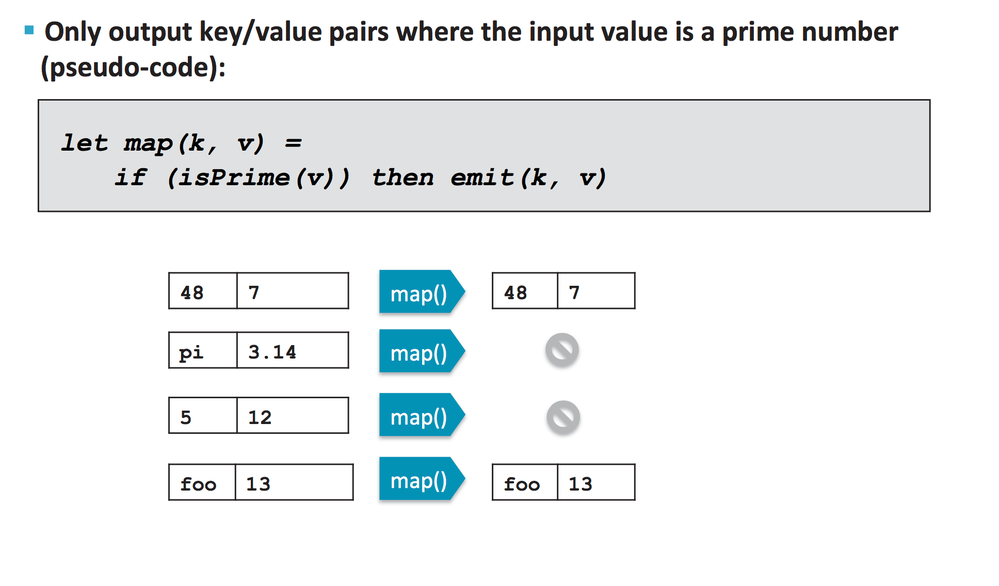
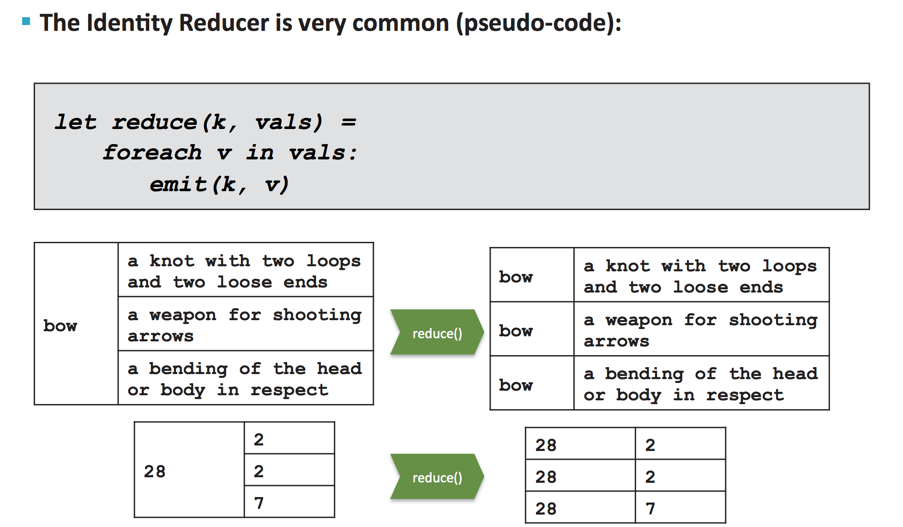

#### 2. Introduction to MapReduce

###### Features of MapReduce

- Automatic parallelization and distribution
- Fault-tolerant
- Clear abstraction for programmers
	- Written in JAVA
	- Can be written in other languages using ``Hadoop Streaming``
- MapReduce abstracts all the ``housekeeping`` away from developer
	- Developers can simply concentrate on writing ``Map`` and ``Reduce`` function

###### MapReduces Flow

###### WordCount Example

- WordCount Mapper

- WordCount Shuffle and Sort

- SumReducer

###### Mappers

- ``Upper Case Mapper``

- ``Explode Mapper``

- ``Filter Mapper``

- ``Changing keyspaces``

- ``Identity Mapper``

###### Reducers

- ``Shuffle & Sort``

- ``Reducer``

- ``Reducer - Sum Reducer``

- ``Reducer - Average Reducer`` 

- ``Reducer - Identity Reducer``

###### Mapper and Reducer

- Mapper
	- Maps input data to intermediate key/value pairs
	- Parse, Filter, Transform
- Reducer
	- Processes Mapped output into final key/value pairs
	- Aggregates data into key/value pairs
             