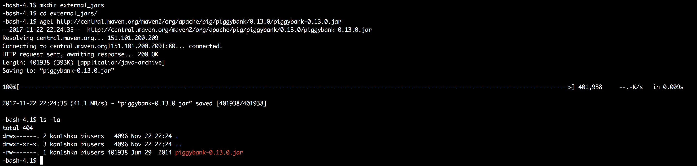
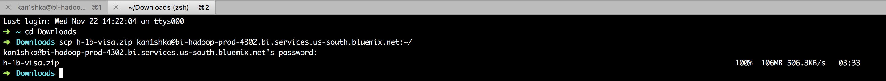
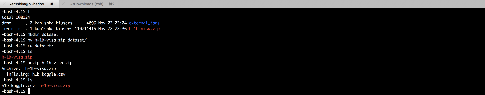
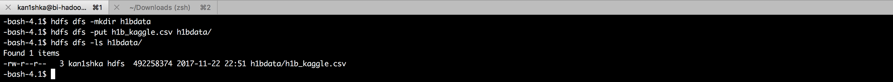
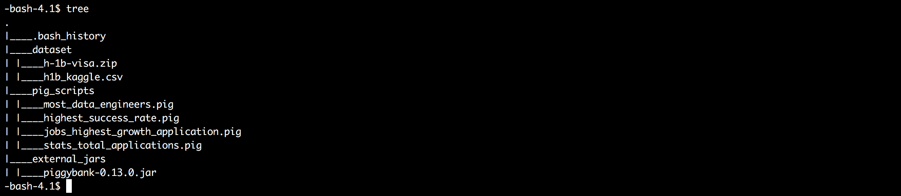

#### 0. Initial Setup

```sh
mkdir external_jars
cd external_jars/
wget http://central.maven.org/maven2/org/apache/pig/piggybank/0.13.0/piggybank-0.13.0.jar
ls -la
```



```sh
cd Downloads
scp h-1b-visa.zip kan1shka@bi-hadoop-prod-4302.bi.services.us-south.bluemix.net:~/
```



```sh
ll
mkdir dataset
mv h-1b-visa.zip dataset/
cd dataset/
ls
unzip h-1b-visa.zip
ls
```



```sh
hdfs dfs -mkdir h1bdata
hdfs dfs -put h1b_kaggle.csv h1bdata/
hdfs dfs -ls h1bdata/
```



```sh
tree
```

