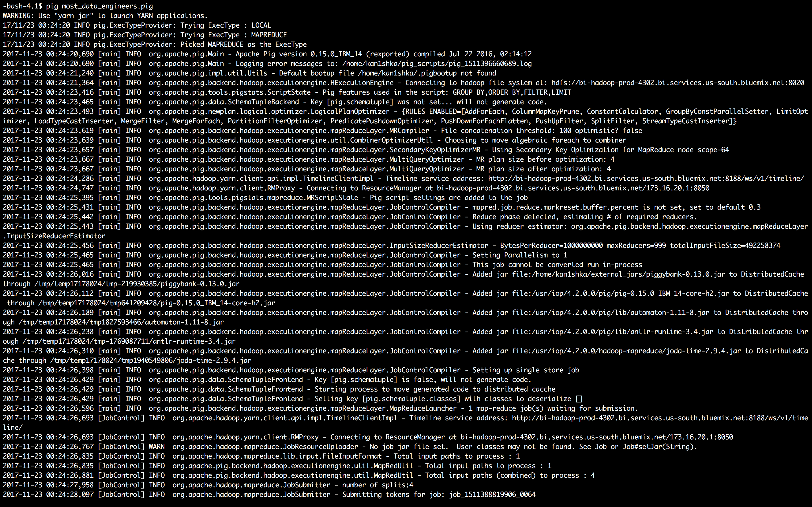
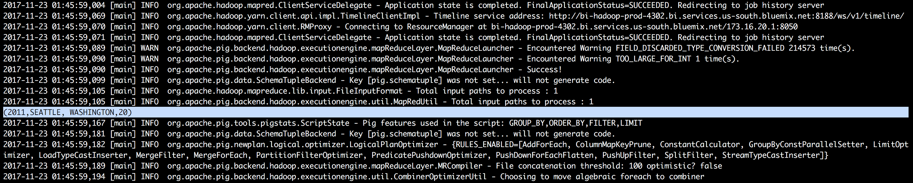
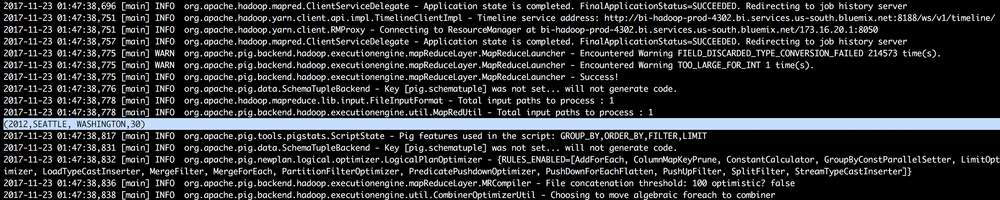
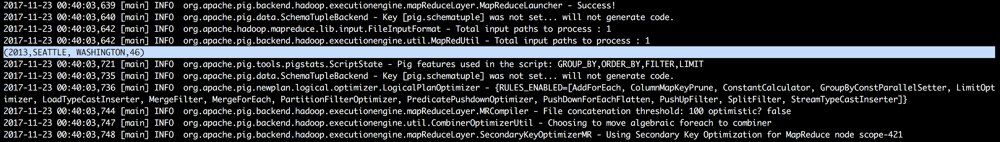
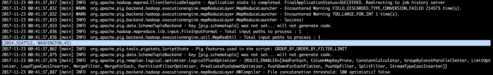
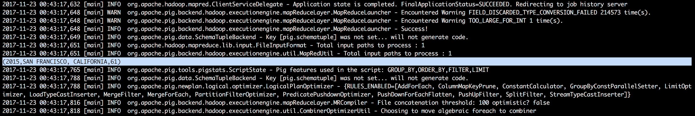
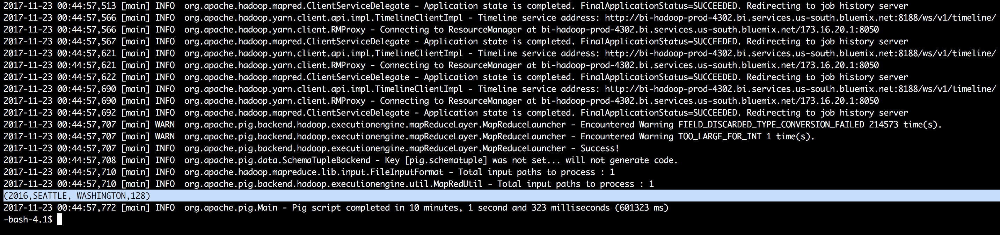

#### 2. Part of US with maximum Data Engineers

[```most_data_engineers.pig```](pig/most_data_engineers.pig)

```sh
pig most_data_engineers.pig
```















- Output

```sh
(2011,SEATTLE, WASHINGTON,20)
(2012,SEATTLE, WASHINGTON,30)
(2013,SEATTLE, WASHINGTON,46)
(2014,SEATTLE, WASHINGTON,45)
(2015,SAN FRANCISCO, CALIFORNIA,61)
(2016,SEATTLE, WASHINGTON,128)
```